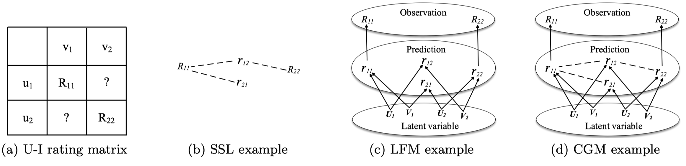
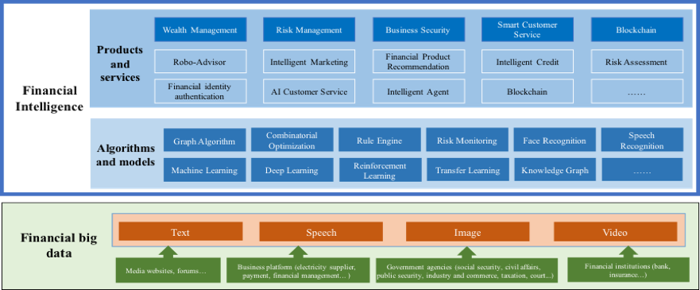
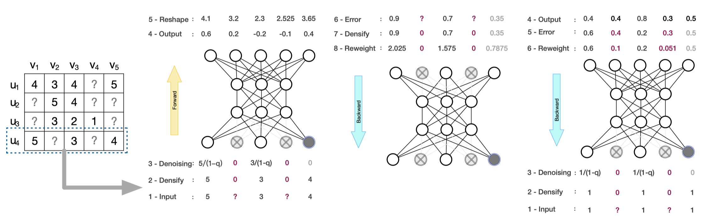
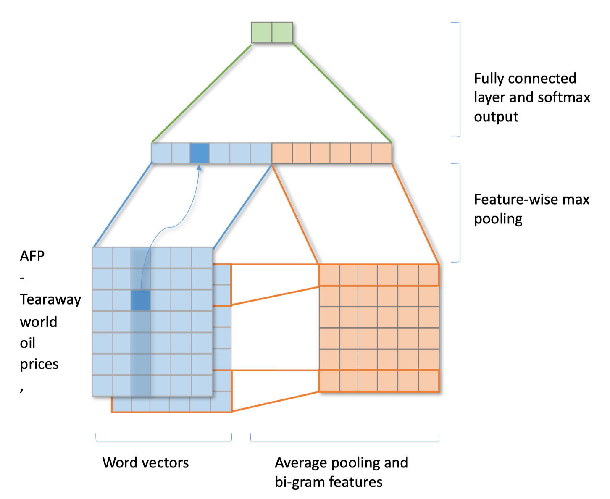
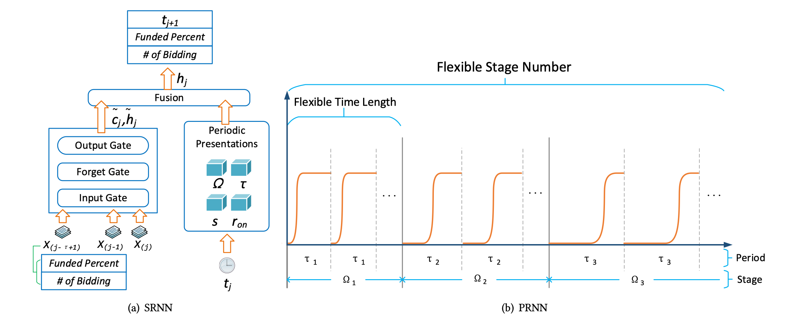
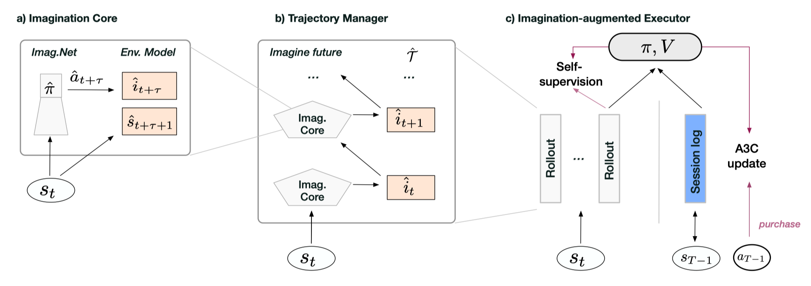

# AI Research Papers

This repository is meant to reorganize several papers related to AI. My research interest focuses on reinforcement learning, neuroscience-inspired AI (e.g., predictive coding) and decentralized ML (or privacy-preserving ML). Currently, I mainly work on collaborative filtering, deep learning, predictive learning and their applications in recommender systems, text mining and time series prediction. 

I also serve as the leader for Bithack technology community, which aims to learn and build decentralized systems, including blockchain, the decentralized web and storage, and even the decentralized network of AIs. Recently, I have created a github organization [BithackTech](https://github.com/BithackTech), sharing our <a href="#head">research materials</a>. I realize that decentralized learning and multi-agent systems will play a significant role in the upcoming decentralized infrastructure (e.g., Solid), where user data is decoupled from the application and kept on one's own hand (e.g., cell phone or decentralized storage) for privacy.

# Contents

- [Semi-supervised Learning Meets Factorization: Learning to Recommend with Chain Graph Model](https://dl.acm.org/citation.cfm?id=3264745). Chaochao Chen, Kevin Chen-Chuan Chang, Qibing Li, and Xiaolin Zheng. ACM Transactions on Knowledge Discovery from Data (TKDD), 2018.

   Keywords: semi-supervised learning, probabilistic graphical model, latent factor model, data sparsity

- [FinBrain: When Finance Meets AI 2.0](https://arxiv.org/abs/1808.08497). Xiaolin Zheng, Mengying Zhu, Qibing Li, Chaochao Chen, Yanchao Tan. Frontiers of Information Technology & Electronic Engineering (FITEE), 2018.

   Keywords: overview, financial intelligence, risk management, Robo-advisor

- [Neural Collaborative Autoencoder](https://arxiv.org/abs/1712.09043). Qibing Li, Xiaolin Zheng, Xinyue Wu. IEEE Transactions on Knowledge and Data Engineering (TKDE 2019), under review. [[code](https://github.com/QibingLee/NCAE)]

   Keywords: recommender system, collaborative filtering, neural network, deep learning

- FNText: A Fast Neural Model for Efficient Text Classification. Anonymous authors. Waiting for ACL 2019. [[code](https://github.com/QibingLee/FNText-classification)]

   Keywords: neural network, text classification, bi-gram

- Stage-LSTM: Modeling Long Time Series with Arbitrary Sampling Rates and an Application on Crowdfunding. Anonymous authors. WWW 2019, under review.

   Keywords: recurrent neural network, time series forecasting, time utility, profit and risk

- [Purchase As Reward: Session-based Recommendation by Imagination Reconstruction](https://openreview.net/forum?id=SkfTIj0cKX&noteId=SyenKQGCA7). Qibing Li and Xiaolin Zheng. ICLR 2019, under review.

   Keywords: self-supervised RL, prediction error minimization, predictive learning, model-based exploration

<a id="head"/>

# Bithack Technologies

[Bithack-seminar](https://github.com/BithackTech/seminar)

[Bithack-research](https://github.com/BithackTech/research)

[Bithack-hackathon](https://github.com/BithackTech/hackathon-bitrun)
